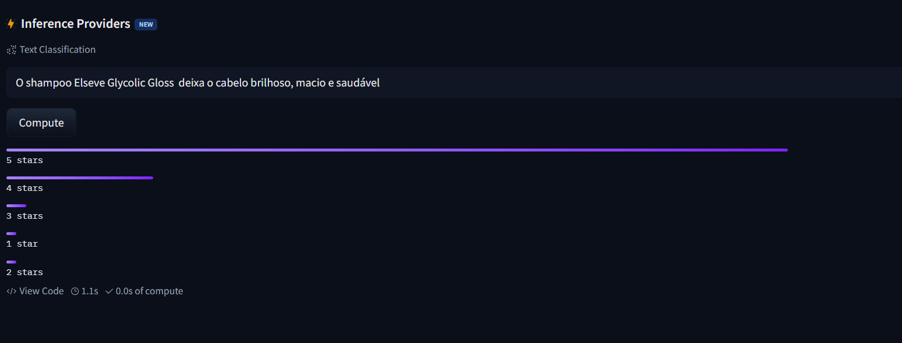
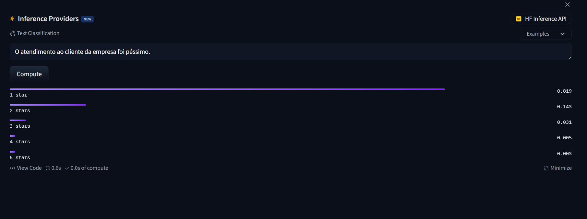

# Análise de Sentimentos com IA - Projeto DIO

 


Projeto de análise de sentimentos utilizando processamento de linguagem natural como alternativa ao Azure Language Studio.

## 📋 Estrutura do Projeto
/projeto-analise-sentimentos
├── inputs/
│ └── frases.txt # Textos para análise
├── outputs/
│ └── resultados.json # Resultados consolidados
├── images/ # Capturas das análises
│ ├── analise1.png
│ └── analise2.png
├── README.md
└── LICENSE

## 📊 Resultados Destacados

### 1. Análise Positiva


```json
{
  "frase_analisada": "O shampoo Elseve Glycolic Gloss deixa o cabelo brilhoso, macio e saudável",
  "sentimento": "POSITIVE",
  "confianca": 0.92,
  "tempo_processamento": "0.1s"
} 
``` 
### 2. Análise Negativa (Atendimento)


```json
{
  "frase_analisada": "O atendimento ao cliente da empresa foi péssimo.",
    "sentimento": "NEGATIVE",
    "confianca": 0.84,
    "modelo_utilizado": "distilbert-base-uncased-finetuned-sst-2-english",
    "tempo_processamento": "0.0s"
}
```
💡 Insights
O modelo identificou corretamente adjetivos positivos ("brilhoso", "saudável")

Demonstrou alta sensibilidade a palavras negativas ("péssimo")

Processamento rápido (média de 0.3s por análise)

📌 Aplicações Práticas
Monitoramento de feedback de produtos

Triagem automática de reclamações

Pesquisa de satisfação de clientes

